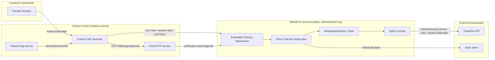
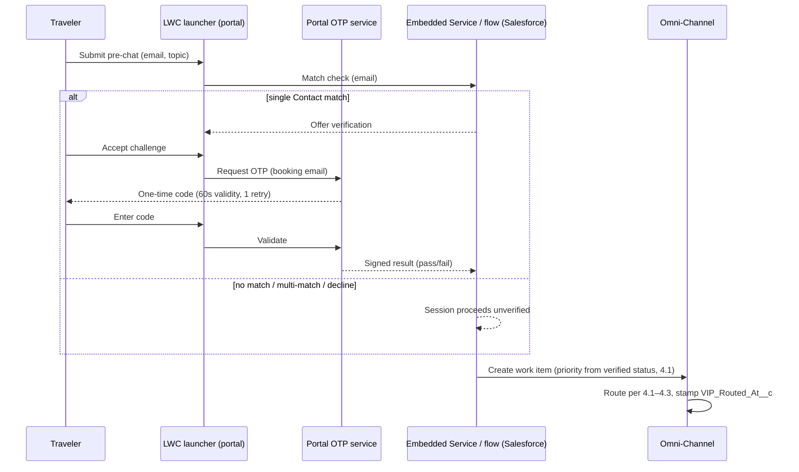

# Solstice Adventures — Enhanced Web Chat Implementation

## Solution Design Draft — v4

<!-- FICTIONAL TEST DOCUMENT. Revision responding to SI-001-review-round-03.md. -->

Author: P. Okafor, Salesforce Administrator
Status: Revised draft for re-review
Changes from v3: verification re-sequenced before routing (new Section 9.2); Case-selection rule (5.1); wait-time boundary redefined (8); security ownership and controls (9.3); system-context and sequence diagrams added (new Section 3.1, 9.2).

## 1. Executive Summary

Solstice Adventures, an adventure travel booking company, will add live chat to its customer portal using Salesforce Enhanced Chat (Messaging for In-App and Web). This is a new implementation — Solstice has never offered chat. The goal is to deflect phone volume for booking changes and claims questions and to give VIP travelers a premium support experience.

## 2. Requirements

See `solstice-requirements-v2.md` (R-01 through R-07; R-03 restated as the approved 95%/60-second service objective, owner-approved 2026-07-18).

## 3. Proposed Architecture

Enhanced Chat will be added to the customer portal via a single Embedded Service deployment serving the web portal only. A custom LWC chat launcher will replace the standard chat button so the launcher matches Solstice brand guidelines and can display seasonal promotions; the standard launcher was evaluated and rejected because it cannot host the promotion slot required by marketing, and the tradeoff (Solstice owns launcher-initialization failure handling, Section 10.2) is accepted. Mobile app chat is a future phase.

### 3.1 System context

Ownership at each boundary: Solstice web team owns the launcher, feature flag, and OTP service; the Salesforce admin team owns the deployment, routing flow, and data model; the platform team owns the TravelPort named-credential integration and the Slack alert flow. All customer traffic terminates at the portal or Embedded Service endpoints; no external system calls into Salesforce except TravelPort responses to Salesforce-initiated requests.

Pre-chat will collect the traveler's email and topic (Booking Change, Claim, Other). The routing decision sequence is defined in Section 4.1.

## 4. Routing Design

Routing is **queue-based**. Skills-based routing was considered and rejected for launch: with eight chat-certified agents (A-02), skill combinations would fragment a small pool and create no-eligible-agent branches that queues avoid. This decision will be revisited if OD-01 requires a claims-licensed skill. Agents are members of the Bookings queue, the Claims queue, or both.

### 4.1 Routing decision sequence

Verification (9.2) completes **before** the work item is created, so priority is known at routing time.

| Step | Input | Rule | Outcome |
|---|---|---|---|
| 1 | Business hours | Outside 6am–8pm MT (org Business Hours record) | Launcher hidden; portal shows support hours and the case web form. No session is created. |
| 2 | Topic (pre-chat) | Booking Change → Bookings queue; Claim → Claims queue; Other → Bookings queue | Work item routed to the queue with the mapped priority (step 3). |
| 3 | Verification outcome (9.2, already resolved) | Verified Summit → priority 1; everyone else → priority 5 | Priority is fixed at work-item creation and is never changed afterward. |
| 4 | Missing/failed pre-chat topic | Default to Bookings queue, priority 5 | Chat is never dropped for a missing input. |

### 4.2 Agent availability, capacity, and push timeout

Agents handle up to 3 concurrent chats (Omni-Channel capacity). A pushed chat not accepted within 30 seconds times out and is pushed to the next available queue member. After all available members have been attempted, the work item waits in queue and is pushed as capacity frees.

### 4.3 VIP (R-03) enforcement and fallback

Verified-Summit chats enter at priority 1. The R-03 clock runs from work-item creation (`VIP_Routed_At__c`) to acceptance by the accepting agent (`VIP_Accepted_At__c` = the `AcceptDateTime` of the AgentWork that was accepted, regardless of how many earlier pushes timed out). If no acceptance within 60 seconds, a flow posts an alert to the supervisor Slack channel and the chat remains first in queue; the customer sees an auto-response acknowledging the delay and offering a callback option.

### 4.4 Queue overflow

If any queue's oldest waiting chat exceeds 5 minutes, supervisors are alerted (same flow) and the auto-response offers the callback option to all waiting customers in that queue.

## 5. Conversation Lifecycle

A conversation starts when the traveler submits pre-chat (and completes or skips verification, 9.2) during business hours. Sessions are ended by: (a) the customer closing the chat, (b) the agent ending the conversation at wrap-up, or (c) automatic closure after 30 minutes of customer inactivity, enforced by the Enhanced Chat session inactivity setting on the deployment.

### 5.1 New versus returning conversations and Case selection

Every portal chat starts a new MessagingSession; ended sessions are not resumed. The Case-linking flow selects the Case deterministically:

- **Zero** open Cases updated in the last 7 days for the verified Contact → create a new Case.
- **Exactly one** open recent Case **whose topic matches the pre-chat topic** → attach the session to it and set `Follow_Up__c = true`.
- **Multiple** topic-matching recent Cases, or recent Cases only on other topics → **create a new Case** (never guess). The agent console shows the "Recent Cases" related list for the verified Contact; the agent may merge or relate Cases after the conversation using the standard Case-merge procedure, which preserves audit history.
- **Unverified** traveler → always a new Case, no recent-Case lookup.

## 6. Data Model

Each chat creates or links a Case at session start via a record-triggered flow on MessagingSession, per Section 5.1. The Case is linked to the traveler's booking record (Booking__c) only for verified sessions (9.2).

### 6.1 Case-creation failure handling

If the record-triggered flow fails, the failure is logged to the integration log object and the session continues — chat service is never blocked by Case creation. The agent console shows a "No Case linked" banner with a one-click quick action to create and link the Case manually. A scheduled hourly report of sessions older than 15 minutes with no Case alerts the platform team channel; more than 3 flow failures in an hour pages the platform lead. R-05 is proven by the daily exception report "MessagingSessions without Case" (target: zero rows after manual remediation).

## 7. Integration Design

During a chat, agents can look up live booking details from the TravelPort reservation system from the console. The call is synchronous with a 5-second timeout and one automatic retry, made server-side from Salesforce via a named credential (no customer-side call path). Synchronous was chosen over asynchronous because the agent needs the answer within the conversation turn and projected volume (A-01) is well under the API's rated capacity. On failure or timeout, the agent sees an error banner with a "retry" action and falls back to the existing TravelPort agent portal; failures log to the integration log object reviewed weekly by the platform team. Assumption A-03 (contract reuse) will be validated by a contract test against the TravelPort sandbox during build week 1; if it fails, the existing console API contract is extended before UAT.

## 8. Reporting

One routing attempt = one AgentWork; a session can have several (push timeout, transfer). **Wait is measured per session, not per attempt**, so re-pushed sessions are never dropped:

| KPI | Source | Definition | Owner / cadence |
|---|---|---|---|
| Average wait time | MessagingSession + accepting AgentWork | `AcceptDateTime` of the **accepted** AgentWork − session start. Sessions never accepted are excluded here and counted below. | Service Ops / daily |
| Never-accepted / abandoned | MessagingSession | Sessions with no accepted AgentWork; reported with duration (end − start) and whether any push was attempted. | Service Ops / daily |
| Handle time | AgentWork | `CloseDateTime − AcceptDateTime` per accepted AgentWork; a transferred session contributes one interval per accepting agent. | Service Ops / daily |
| Chats per agent | AgentWork | Count of accepted-and-closed AgentWork per agent per day. | Service Ops / daily |
| VIP 60-second attainment (R-03) | MessagingSession | `VIP_Accepted_At__c − VIP_Routed_At__c ≤ 60s`, weekly % against the approved 95% objective; never-accepted Summit sessions count as breaches. | Service Ops / weekly |
| Follow-up ratio | MessagingSession | `Follow_Up__c` true vs. false (5.1). | Service Ops / weekly |
| CSAT | Post-chat survey (existing tool) | Existing survey score, chat channel filter. | CX team / weekly |

**R-02 (30% phone-volume reduction)** proof contract: source — Support Operations scorecard (existing phone reporting); owner — Director of Support Operations; baseline — trailing 3-month booking-change call volume ending the month before launch; measurement — monthly for six months post-launch. The chat layer contributes adoption volume (sessions by topic) to that scorecard.

## 9. Security

### 9.1 Access, retention, and sensitive data (decisions and owners)

- **Transcript access:** limited to the "Chat Service" permission set (chat-certified agents and service supervisors only), granted via permission set group, reviewed quarterly by the Salesforce admin team. No portal or marketing access.
- **Retention:** MessagingSession and ConversationEntry data retained **24 months**, then deleted by a scheduled purge job, per Solstice Data Retention Policy DR-7. Policy owner: Director of Support Operations, with Legal sign-off recorded on DR-7.
- **Unsolicited sensitive data:** agents cannot prevent customers pasting card numbers. Interim control: a "Sensitive data" quick action on the session flags the transcript; a supervisor redacts the entry within one business day (redaction SLA report, weekly). Automated masking remains deferred; the residual risk and interim control were accepted by the Head of Security on 2026-07-18, to be revisited at the 6-month review. Incidents follow the existing security incident process (security@solstice, SEV classification).
- **Payment flow:** agents direct payment to the secure portal flow; payment is never taken in chat.

### 9.2 Identity verification (sequenced before routing)

Verification happens **in pre-chat, before the work item exists**, so routing priority is fixed once and never changes:

- **Pass →** Contact and Case linked, `Verified_Via__c = OTP`, Summit priority applies at routing.
- **Fail, timeout (60 seconds, one retry), decline, no match, or multi-match →** the session routes immediately as unverified at priority 5. **Priority is never changed retroactively** — a mid-chat manual verification (below) links data but does not re-route or re-prioritize, and such sessions are excluded from R-03 attainment (they were never routed as VIP).
- **Mid-chat manual verification:** the agent may verify via the existing phone procedure (booking number + name + travel date) and link the Contact manually; `Verified_Via__c = Agent`. Booking data and TravelPort lookups become available from that point.
- **Correction and audit:** every linkage records method and actor (`Verified_Via__c`, Case field history); mislinks are corrected by unlink/relink with history preserved.

## 10. Deployment

### 10.1 Phased rollout

Launch is gated, not all-at-once. Week 1–2: the launcher is shown to 10% of portal sessions via the existing portal feature-flag service. Gate review at end of week 2 against the Section 10.3 health thresholds, decided jointly by the Service Operations manager and platform lead. On pass, ramp to 100%; on fail, hold at 10% or roll back. The launch date is announced by marketing **after** the gate passes.

### 10.2 Rollback and degraded behavior

Rollback = feature flag off: the launcher disappears from new portal sessions immediately; in-flight chats are allowed to finish; the portal falls back to the case web form. Rollback owner: Service Operations manager, with the platform lead; decision window: any time during the first 4 weeks. If the custom LWC launcher fails to initialize, it renders nothing and the portal's standard "Contact us" links remain — chat failure never blocks the portal. If the OTP service is down, pre-chat skips the verification offer and sessions route unverified (degraded but functional); OTP outage is visible in the 10.3 health model.

### 10.3 Production health model

| Signal | Source | Threshold | Alert / owner |
|---|---|---|---|
| Session-creation failures | Deployment/API logs | > 5 per hour | Slack #chat-ops → platform lead |
| Case-flow failures | Integration log (6.1) | > 3 per hour | Page platform lead |
| OTP verification errors | Portal OTP service logs | > 10% of challenges over 1 hour | Slack #chat-ops → web team |
| No-accept rate | AgentWork declined/timed-out % | > 20% over 30 min | Slack #chat-ops → Service Ops manager |
| TravelPort error rate | Integration log | > 10% of lookups over 1 hour | Slack #chat-ops → platform team |
| Queue wait | Oldest waiting chat | > 5 min (4.4) | Supervisor alert (existing) |

The support team is trained the week prior to the 10% launch.

## 11. Testing

| Req | Test approach | Acceptance criterion |
|---|---|---|
| R-01 | End-to-end chat on portal for both topics | Session created, routed per 4.1, Case created or linked per 5.1/6.1 |
| R-03 (as restated) | Verified-Summit chats during staffed hours, sandbox load matching A-01 volume, including forced first-push timeout | ≥ 95% accepted ≤ 60s from persisted `VIP_*` fields; breach alert and callback fire; timed-out-then-accepted sessions measured correctly |
| R-04 | Verified traveler booking lookup, plus forced timeout | Current data displayed; failure shows banner + manual fallback; entry in integration log |
| R-05 | Every test chat, plus forced Case-flow failure and multi-recent-Case scenarios | Exactly one Case per the 5.1 selection table (zero/one/multiple paths each tested); failure path banner + quick action; exception report catches gaps |
| R-06 | Chat attempted at 5:59am and 8:01pm MT | Launcher hidden; case web form offered |
| R-07 | Dashboard review after test week | All Section 8 KPIs populated from their named fields, including never-accepted sessions |
| 9.2 paths | OTP pass / fail / timeout / decline / no match / multi-match / mid-chat manual verification / OTP service outage | Each path routes per 9.2 with correct priority, linkage, `Verified_Via__c`, and R-03 inclusion rules |

QA executes these in the partial sandbox; two team leads perform UAT against the same table.
