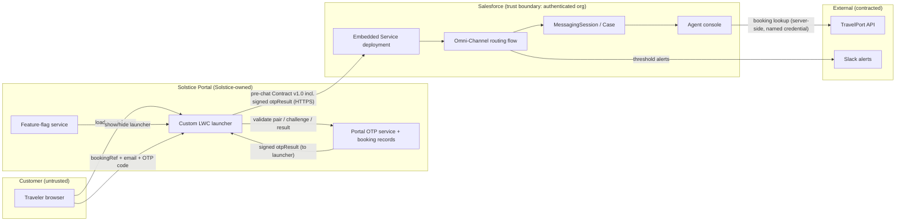
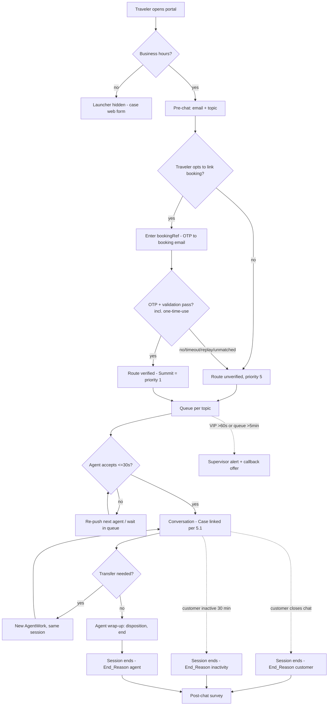
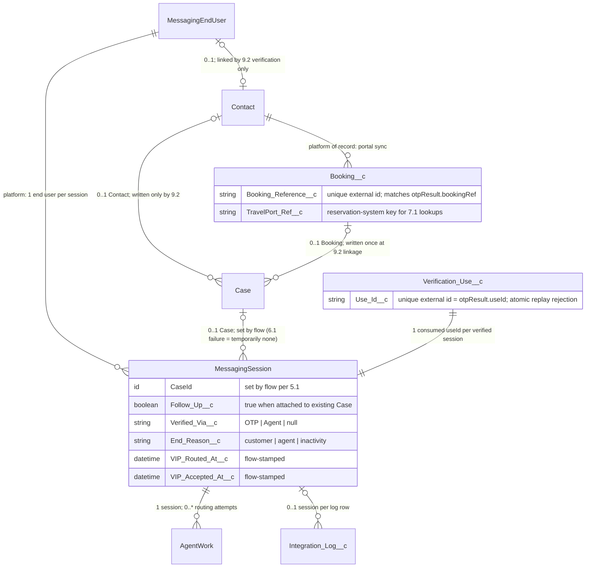
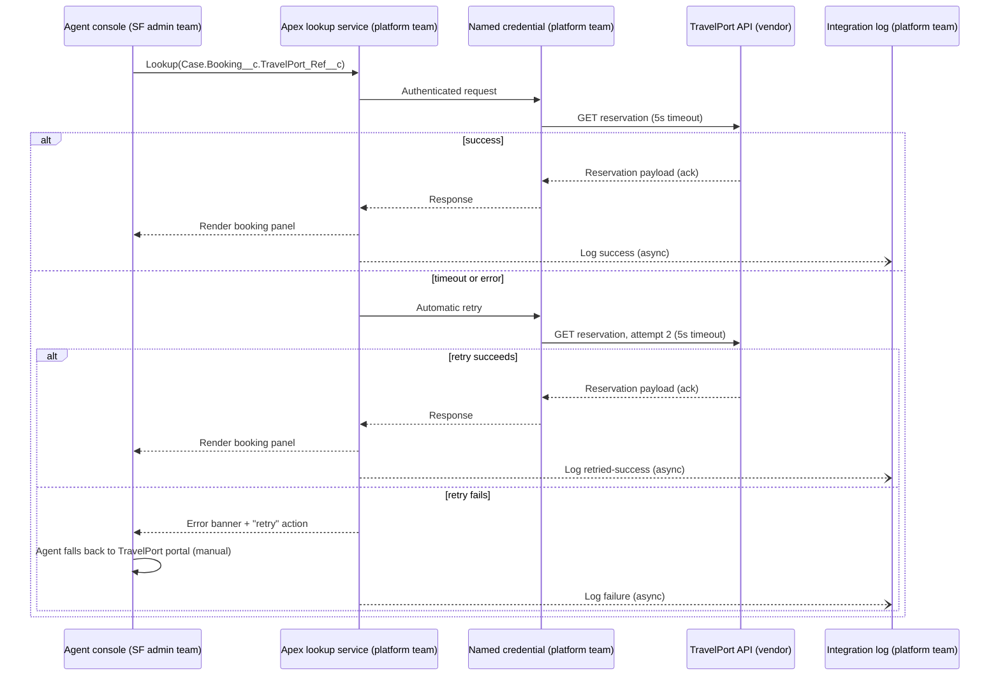
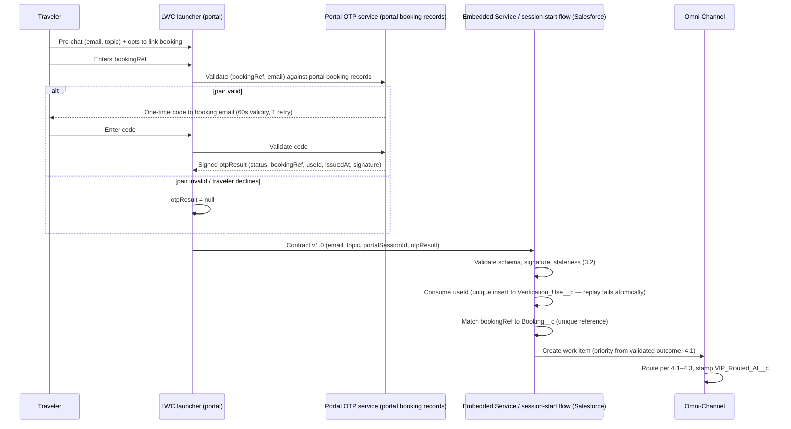

# Solstice Adventures — Enhanced Web Chat Implementation

## Solution Design Draft — v7

<!-- FICTIONAL TEST DOCUMENT. Revision responding to SI-001-review-round-06.md. -->

Author: P. Okafor, Salesforce Administrator
Status: Revised draft for re-review
Changes from v6: verification redesigned to be booking-anchored — the traveler supplies the booking reference, removing the pre-verification match interface entirely (3.2, 9.2); one-time-use replay state added (3.2, 6.2); booking selection, linkage, and TravelPort input now traceable end to end (6.2, 7.1, 9.2); round-6 deferred items swept (4.2, 5, 5.3, 6.2, 7.1).

## 1. Executive Summary

Solstice Adventures, an adventure travel booking company, will add live chat to its customer portal using Salesforce Enhanced Chat (Messaging for In-App and Web). This is a new implementation — Solstice has never offered chat. The goal is to deflect phone volume for booking changes and claims questions and to give VIP travelers a premium support experience.

## 2. Requirements

See `solstice-requirements-v2.md` (R-01 through R-07; R-03 restated as the approved 95%/60-second service objective, owner-approved 2026-07-18).

## 3. Proposed Architecture

Enhanced Chat will be added to the customer portal via a single Embedded Service deployment serving the web portal only. A custom LWC chat launcher will replace the standard chat button so the launcher matches Solstice brand guidelines and can display seasonal promotions; the standard launcher was evaluated and rejected because it cannot host the promotion slot required by marketing, and the tradeoff (Solstice owns launcher-initialization failure handling, Section 10.2, and the interface contract, Section 3.2) is accepted. Mobile app chat is a future phase.

**OD-02 disposition:** the architecture impact of launcher placement is closed (dispositioned 2026-07-19, recorded in `solstice-assumptions-open-decisions-v3.md`): the launcher loads the same deployment and sends the same contract regardless of page position. Placement remains open **only** as a UX decision owned by the e-commerce team, with one reopening condition — if a chosen placement requires markup or load-order changes that affect launcher initialization, the change re-enters design review.

### 3.1 System context

Verification is **booking-anchored**: the traveler who wants booking context supplies their booking reference in pre-chat. There is no pre-verification lookup against Salesforce — the launcher's only Salesforce interface is the Contract v1.0 submission. The signed OTP result reaches Salesforce **only inside that payload**.

Ownership at each boundary: Solstice web team owns the launcher, feature flag, and OTP service; the Salesforce admin team owns the deployment, routing flow, and data model; the platform team owns the TravelPort named-credential integration and the Slack alert flow. All customer traffic terminates at the portal or Embedded Service endpoints; no external system calls into Salesforce except TravelPort responses to Salesforce-initiated requests. The OTP service validates booking references against the **portal's own booking records** (Solstice-side), so no anonymous caller ever learns from Salesforce whether a customer record exists.

### 3.2 Launcher-to-Salesforce interface contract

The launcher submits pre-chat as **Contract v1.0**, a versioned JSON payload in the Embedded Service hidden pre-chat fields — the **only** channel by which verification state enters Salesforce:

| Field | Type | Rule |
|---|---|---|
| `contractVersion` | string | Must equal a version the deployment accepts (launch: `1.0`) |
| `portalSessionId` | string | Portal session correlation id (logging/diagnostics) |
| `email` | string | Traveler-typed; **untrusted**; used only as pre-chat context, never for identity |
| `topic` | enum | `booking_change` / `claim` / `other` |
| `otpResult` | object or null | `{status, bookingRef, useId, issuedAt, signature}` — produced and signed by the portal OTP service, returned to the launcher, forwarded verbatim |

- **Validation is Salesforce-side**, in the session-start flow: schema check, enum check, signature verification against the OTP service public key, staleness check (`issuedAt` older than 5 minutes = stale), and **one-time-use enforcement**: the flow inserts `otpResult.useId` into `Verification_Use__c`, whose external-Id field is unique — a duplicate insert **fails atomically**, and the session proceeds unverified with a `replay_reject` log entry. A signed result can therefore be accepted exactly once, org-wide, regardless of portal session; the consumed record (useId, timestamp, session) is the audit evidence.
- **Booking resolution:** on a valid, unconsumed `otpResult`, the flow matches `bookingRef` against `Booking__c.Booking_Reference__c` (unique external id): exactly one match → link per 9.2; no match (e.g. booking not yet synced) → session proceeds unverified with a `booking_unmatched` log entry. Multiple matches are impossible by the unique index.
- **Rejection behavior:** malformed payload, unknown `contractVersion`, invalid signature, stale or replayed `otpResult`, or unmatched booking → the session proceeds as **unverified**, topic defaults per 4.1, and the appropriate reject entry is logged. The chat is never dropped.
- **Release compatibility:** contract changes require a new version, the joint release checklist (web team + Salesforce admin team), and the CI contract test passing against the sandbox **before** either side releases.
- **Detection:** `contract_reject` (including `replay_reject`) rate is a Section 10.3 health signal.

## 4. Routing Design

Routing is **queue-based**. Skills-based routing was considered and rejected for launch: with eight chat-certified agents (A-02), skill combinations would fragment a small pool and create no-eligible-agent branches that queues avoid. This decision will be revisited if OD-01 requires a claims-licensed skill. Agents are members of the Bookings queue, the Claims queue, or both.

### 4.1 Routing decision sequence

Verification (9.2) completes **before** the work item is created, so priority is known at routing time.

| Step | Input | Rule | Outcome |
|---|---|---|---|
| 1 | Business hours | Outside 6am–8pm MT (org Business Hours record) | Launcher hidden; portal shows support hours and the case web form. No session is created. |
| 2 | Topic (validated contract field) | `booking_change` → Bookings; `claim` → Claims; `other` → Bookings | Work item routed to the queue with the mapped priority (step 3). |
| 3 | Verification outcome (9.2, already resolved) | Verified Summit → priority 1; everyone else → priority 5 | Priority is fixed at work-item creation and never changed afterward. |
| 4 | Missing/failed/rejected contract fields | Default to Bookings queue, priority 5, unverified | Chat is never dropped for a bad input. |

### 4.2 Agent availability, capacity, and push timeout

An agent is eligible for a push when their Omni-Channel presence status is **"Available – Chat"** and they hold spare chat capacity. Chat capacity is 3 concurrent chats; chat-shift agents do not take phone work while in this status, so chat capacity does not interact with other channels at launch (a combined-presence model is out of scope until the mobile phase). The capacity of 3 is the pilot-team benchmark; it is validated during the 10% rollout via handle-time and no-accept monitoring, and is an input to the Section 10.1 gate review. A pushed chat not accepted within 30 seconds times out and is pushed to the next available queue member; after all available members have been attempted, the work item waits in queue and is pushed as capacity frees.

### 4.3 VIP (R-03) enforcement and fallback

Verified-Summit chats enter at priority 1. The R-03 clock runs from work-item creation (`VIP_Routed_At__c`) to acceptance by the accepting agent (`VIP_Accepted_At__c`). If no acceptance within 60 seconds, a flow posts an alert to the supervisor Slack channel and the chat remains first in queue; the customer sees an auto-response acknowledging the delay and offering a callback option.

### 4.4 Queue overflow

If any queue's oldest waiting chat exceeds 5 minutes, supervisors are alerted (same flow) and the auto-response offers the callback option to all waiting customers in that queue.

## 5. Conversation Lifecycle

A conversation starts when the traveler submits pre-chat (with or without verification, 9.2) during business hours. Sessions end by: (a) the customer closing the chat, (b) the agent ending the conversation at wrap-up, or (c) automatic closure after 30 minutes of customer inactivity, enforced by the deployment's session inactivity setting. **The end reason is recorded on the session** (`End_Reason__c`: customer / agent / inactivity, stamped by the ending flow), so the three end types are distinguishable in reporting and in the 5.2 lifecycle tests.

### 5.1 New versus returning conversations and Case selection

Every accepted pre-chat submission initiates a **new conversation** (enforcement in 5.2). The Case-linking flow selects the Case deterministically:

- **Zero** open Cases updated in the last 7 days for the verified Contact → create a new Case.
- **Exactly one** open recent Case **whose topic matches the pre-chat topic** → attach the session to it and set `Follow_Up__c = true`.
- **Multiple** topic-matching recent Cases, or recent Cases only on other topics → **create a new Case** (never guess). The agent console shows the "Recent Cases" related list; the agent may merge or relate Cases afterward via the standard Case-merge procedure, which preserves audit history.
- **Unverified** traveler → always a new Case, no recent-Case lookup.

### 5.2 Session non-resumption: a launch-gating design invariant

Non-resumption is a **design invariant** — Case selection (5.1), verification sequencing (9.2), and every per-session KPI boundary (Section 8) depend on each pre-chat submission producing a new MessagingSession.

- **Enforcing mechanism:** (1) the launcher never stores a conversation token across page loads — every pre-chat submission requests a fresh conversation; (2) the deployment's session inactivity and end settings close the conversation on each Section 5 end condition.
- **Acceptance evidence (build week 1):** for each end condition — customer close, agent end, inactivity timeout — the sandbox test re-opens the portal and starts a chat, asserting the new `MessagingSession.Id` differs, the prior session remains ended, and `End_Reason__c` matches the end type exercised.
- **Gate, not workaround:** if **any** return path reuses a prior `MessagingSession.Id`, the acceptance test fails and launch preparation stops — the invariant is restored by configuration or launcher change and the test re-run; if it cannot be restored, the design returns to review before UAT. No alternate resumed-session operating model is offered; documenting one is explicitly not an acceptance path.
- **Customer/agent experience on return:** the returning traveler always gets a fresh chat (new pre-chat, new verification offer); continuity comes from the linked Case history, not transcript resumption.

### 5.3 End-to-end process view

## 6. Data Model

### 6.1 Case-creation failure handling

If the record-triggered flow fails, the failure is logged to the integration log (7.2) and the session continues — chat service is never blocked by Case creation. The agent console shows a "No Case linked" banner with a one-click quick action to create and link the Case manually. A scheduled hourly report of sessions older than 15 minutes with no Case alerts the platform team channel; more than 3 flow failures in an hour pages the platform lead. R-05 is proven by the daily exception report "MessagingSessions without Case" (target: zero rows after manual remediation).

### 6.2 Data relationships

Sources of truth: the **Case** owns the Contact and Booking associations — each written exactly once by the 9.2 linkage (OTP or agent-verified), read-only everywhere else. `Booking__c` records are synced from the portal booking system (the portal is the system of record; TravelPort holds the live reservation). The MessagingSession → Case lookup is the only session-to-Case relationship; no junction object exists. MessagingEndUser is platform-managed and gains a Contact link only through verification. All custom fields are written only by the routing/verification flows; reports read, never write. AgentWork is platform-managed; the design adds no fields to it.

## 7. Integration Design

During a chat, agents can look up live reservation details from TravelPort for **the booking linked to the Case**: the console action reads `Case.Booking__c.TravelPort_Ref__c` and passes it as `bookingRef` — the agent never types a reference, and unverified sessions (no Booking link) have no lookup action. Synchronous was chosen over asynchronous because the agent needs the answer within the conversation turn and projected volume (A-01) is well under the API's rated capacity. Assumption A-03 (contract reuse) will be validated by a contract test against the TravelPort sandbox during build week 1; if it fails, the existing console API contract is extended before UAT.

### 7.1 TravelPort lookup sequence

### 7.2 Integration log object

`Integration_Log__c`: `Timestamp`, `System` (TravelPort / CaseFlow / Contract / OTP), `Operation`, `Status` (success / retried-success / failure / reject), `ErrorCode` (incl. `replay_reject`, `booking_unmatched`), `Detail` (no customer PII beyond record ids), optional `MessagingSession` lookup. Owner: platform team. Reviewed weekly and monitored hourly (6.1, 10.3). Retention: 12 months, purged by the same scheduled framework as 9.1 with the same failure alerting.

## 8. Reporting

One routing attempt = one AgentWork; a session can have several (push timeout, transfer). **Wait is measured per session, not per attempt**:

| KPI | Source | Definition | Owner / cadence |
|---|---|---|---|
| Average wait time | MessagingSession + accepting AgentWork | `AcceptDateTime` of the **accepted** AgentWork − session start. Never-accepted sessions excluded here, counted below. | Service Ops / daily |
| Never-accepted / abandoned | MessagingSession | Sessions with no accepted AgentWork; duration (end − start), `End_Reason__c`, and whether any push was attempted. | Service Ops / daily |
| Handle time | AgentWork | `CloseDateTime − AcceptDateTime` per accepted AgentWork; a transferred session contributes one interval per accepting agent. | Service Ops / daily |
| Chats per agent | AgentWork | Accepted-and-closed AgentWork per agent per day. | Service Ops / daily |
| VIP 60-second attainment (R-03) | MessagingSession | `VIP_Accepted_At__c − VIP_Routed_At__c ≤ 60s`, weekly % against the 95% objective; never-accepted Summit sessions count as breaches. | Service Ops / weekly |
| Follow-up ratio | MessagingSession | `Follow_Up__c` true vs. false (5.1). | Service Ops / weekly |
| CSAT | Post-chat survey (existing tool) | Existing survey score, chat channel filter. | CX team / weekly |

All KPI boundaries assume the 5.2 invariant (one pre-chat = one MessagingSession); the 5.2 gate protects their validity.

**R-02 (30% phone-volume reduction)** proof contract: source — Support Operations scorecard; owner — Director of Support Operations; baseline — trailing 3-month booking-change call volume ending the month before launch; measurement — monthly for six months post-launch. The chat layer contributes adoption volume (sessions by topic).

## 9. Security

### 9.1 Access, retention, and sensitive data (decisions and owners)

- **Transcript access:** limited to the "Chat Service" permission set (chat-certified agents and service supervisors), granted via permission set group, reviewed quarterly by the Salesforce admin team. No portal or marketing access.
- **Retention:** MessagingSession and ConversationEntry data retained **24 months**, then deleted by a scheduled purge job, per Data Retention Policy DR-7 (owner: Director of Support Operations, Legal sign-off recorded on DR-7). Purge-job failure alerts the Salesforce admin team and is re-run per the documented job-recovery procedure; a monthly report confirms no data older than the retention window.
- **Unsolicited sensitive data:** agents flag the session via the "Sensitive data" quick action; a supervisor redacts within one business day. Redaction mechanism is verified in the build-week-1 sandbox test; if entry-level redaction proves unsupported, the fallback control — restricted access, 24-month purge, and incident process — is the accepted interim, per the Head of Security's 2026-07-18 risk acceptance, revisited at the 6-month review.
- **Payment flow:** agents direct payment to the secure portal flow; payment is never taken in chat.

### 9.2 Identity verification (booking-anchored, sequenced before routing)

The traveler proves identity by **knowing their booking reference and controlling the booking email** — validated entirely on the portal side, so Salesforce never answers an anonymous existence query:

- **Pass →** the flow links the Case to the matched `Booking__c` **and** to that booking's Contact (the booking, not the typed email, is the identity anchor), links MessagingEndUser to the Contact, sets `Verified_Via__c = OTP`, and applies Summit priority at routing if that Contact is Summit tier (A-04).
- **Any failure — invalid pair, OTP fail/timeout/decline, bad signature, stale, replayed useId, unmatched booking →** the session routes immediately as unverified at priority 5 with the specific reject logged. Priority is never changed retroactively; mid-chat manual verification (existing phone procedure: booking number + name + travel date; `Verified_Via__c = Agent`) performs the same Case–Booking–Contact linkage and enables the TravelPort lookup, but does not re-route and is excluded from R-03 attainment.
- **Correction and audit:** every linkage records method and actor (`Verified_Via__c`, Case field history); the consumed `Verification_Use__c` row is the replay-audit evidence; mislinks are corrected by unlink/relink with history preserved.

## 10. Deployment

### 10.1 Phased rollout

Week 1–2: the launcher is shown to 10% of portal sessions via the portal feature-flag service. Gate review at end of week 2 against the Section 10.3 health thresholds plus the 4.2 capacity validation, decided jointly by the Service Operations manager and platform lead. On pass, ramp to 100%; on fail, hold at 10% or roll back. Marketing announces **after** the gate passes.

### 10.2 Rollback and degraded behavior

Rollback = feature flag off: the launcher disappears from new portal sessions immediately; in-flight chats finish; the portal falls back to the case web form. Rollback owner: Service Operations manager with the platform lead; decision window: first 4 weeks. Launcher initialization failure renders nothing (portal unaffected). **Feature-flag service failure fails closed** — the launcher defaults to hidden. OTP service outage → pre-chat skips the booking-link offer; sessions route unverified (degraded but functional).

### 10.3 Production health model

| Signal | Source | Threshold | Alert / owner |
|---|---|---|---|
| Session-creation failures | Deployment/API logs | > 5 per hour | Slack #chat-ops → platform lead |
| Case-flow failures | Integration log (6.1) | > 3 per hour | Page platform lead |
| Contract rejections incl. replay/unmatched (3.2) | Integration log | > 5 per hour | Slack #chat-ops → web team + SF admin |
| OTP verification errors | Portal OTP service logs | > 10% of challenges over 1 hour | Slack #chat-ops → web team |
| No-accept rate | AgentWork declined/timed-out % | > 20% over 30 min | Slack #chat-ops → Service Ops manager |
| TravelPort error rate | Integration log | > 10% of lookups over 1 hour | Slack #chat-ops → platform team |
| Queue wait | Oldest waiting chat | > 5 min (4.4) | Supervisor alert (existing) |

**Alert-path resilience:** all Slack alerts dual-write to the ops dashboard, and a weekly synthetic test alert verifies Slack delivery. The support team is trained the week prior to the 10% launch.

## 11. Testing

| Req / area | Test approach | Acceptance criterion |
|---|---|---|
| R-01 | End-to-end chat on portal for both topics | Session created, routed per 4.1, Case per 5.1/6.1 |
| R-03 | Verified-Summit chats at A-01 volume, incl. forced first-push timeout | ≥ 95% ≤ 60s from `VIP_*` fields; breach alert + callback fire; timed-out-then-accepted measured |
| R-04 | Verified booking lookup + forced timeout + forced retry-fail; attempt lookup on unverified session | Linked booking's data displayed via `TravelPort_Ref__c`; no lookup action without a Booking link; failure banner + manual fallback; log rows per 7.1 |
| R-05 | Every chat + forced Case-flow failure + zero/one/multiple recent-Case scenarios | Exactly one Case per 5.1 table; banner + quick action; exception report catches gaps |
| R-06 | Chat at 5:59am and 8:01pm MT | Launcher hidden; case web form offered |
| R-07 | Dashboard review after test week | All Section 8 KPIs populated, incl. never-accepted and `End_Reason__c` splits |
| Lifecycle (5.2) | After each end condition, traveler returns and starts a chat | New `MessagingSession.Id`; prior session ended with correct `End_Reason__c`. Any reuse = test failure = launch stops per the 5.2 gate. |
| Identity (9.2) | OTP pass / invalid pair / fail / timeout / decline / unmatched booking / manual verification / OTP outage | Correct priority, Case–Booking–Contact linkage, `Verified_Via__c`, R-03 inclusion per 9.2 |
| Replay (3.2) | Submit the same valid `otpResult` twice (same and different portal sessions) | First submission verifies; second fails the unique `Verification_Use__c` insert, routes unverified, logs `replay_reject` |
| Contract (3.2) | Each supported payload variant + malformed / bad signature / stale / unknown version | Valid variants route correctly; invalid route unverified with `contract_reject` logged |
| Capacity (4.2) | 10% phase monitoring | Handle time and no-accept rate within thresholds at capacity 3; result recorded as gate input |
| Operations | Feature-flag outage; Slack alert failure; purge-job failure; rollback while chats are routing | Flag fails closed; dashboard rows persist + synthetic alert; purge failure alerts and re-runs; in-flight chats finish, no new sessions |
| Redaction (9.1) | Supervisor redaction procedure on sandbox transcript | Entry redacted/annotated and action recorded, or fallback control documented and accepted |

QA executes these in the partial sandbox; two team leads perform UAT against the same table.
