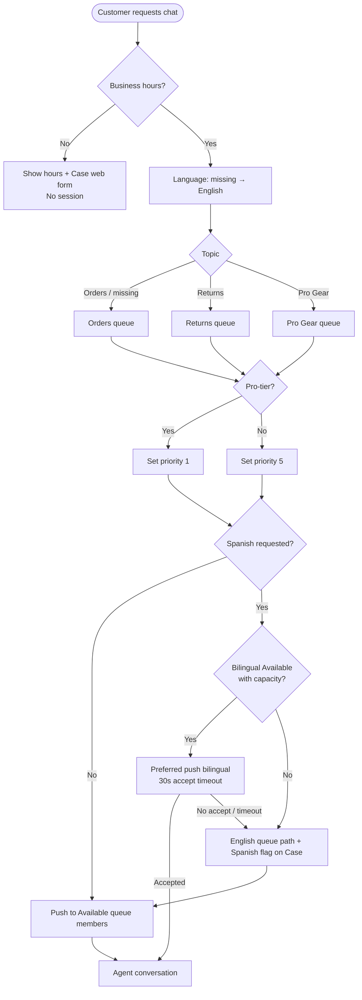

# Northstar Customer Support — Legacy Chat to Enhanced Chat Migration

## Solution Design Draft — v2

<!-- FICTIONAL DEMO DOCUMENT. Revision responding to UX-001-review-round-01.md. -->

Author: J. Rivera, Associate Consultant
Status: Revised draft for re-review
Changes from v1: Sections 4–12 substantially revised; new routing decision sequence (5.1) with mermaid diagram; owner fallback (5.2); dual Embedded Service deployments; drop of Chat_Interaction__c; KPI definitions with LiveChatTranscript mapping; proactive expiry, mobile ownership, cutover/rollback, and testing depth expanded.

## 1. Executive Summary

Northstar Outdoor Equipment currently supports customers through Salesforce Legacy Chat on its e-commerce website. Salesforce has announced Legacy Chat retirement, and Northstar will migrate to Enhanced Chat (Messaging for In-App and Web), extending chat to the Northstar mobile app for the first time. This document describes the target architecture, routing design, data model, and migration plan.

## 2. Requirements

See `northstar-requirements.md` for the full list (R-01 through R-08).

## 3. Current State

Legacy Chat serves the website only, with three chat buttons (Orders, Returns, Pro Gear) mapped to three agent skills. Roughly 900 chats per week are handled by 14 agents across two shifts. Reporting is built on LiveChatTranscript: weekly dashboards show average wait time, abandonment rate, and agent handle time.

## 4. Proposed Architecture

Enhanced Chat will replace Legacy Chat on the website and add in-app messaging in the Northstar mobile app.

### 4.1 Dual Embedded Service deployments

**Northstar will use two Embedded Service deployments** — one for the website and one for the Northstar mobile app. This is required because:

- **R-01** and **R-02** land on different schedules: web cutover is Week 1; mobile depends on the app-store release (Week 3). A single deployment cannot be partially cut over by channel.
- Pre-chat fields, branding, authentication context, and channel entry points differ: web visitors may be anonymous; mobile users are logged-in (R-02).
- Deployment-scoped settings (session inactivity, proactive invitation eligibility, branding) must be independent so a mobile config change does not risk the web channel after go-live.

| Deployment | Channel | Entry | Identity at start |
|---|---|---|---|
| `ES-Web-Support` | Website support pages | Embedded Service snippet | Optional email via pre-chat |
| `ES-Mobile-App` | Northstar iOS/Android app | Messaging for In-App SDK | Logged-in customer identifier from app wrapper |

Both deployments share the same Omni-Channel routing entry (Section 5), the same three queues, and the same Case-creation flow. Section 9's wave plan cuts over each deployment independently.

### 4.2 Pre-chat and Case creation

Pre-chat will collect the customer's email, topic (Orders / Returns / Pro Gear), and preferred language (English / Spanish). Conversations create or attach a Case automatically via a record-triggered flow on MessagingSession at session start (R-07). Contact matching uses the pre-chat email address on web; on mobile, the app-supplied customer identifier is used to match Contact first, with email as fallback.

Customers browsing key support pages will see a proactive chat invitation offering help (R-08). Invitation behavior is defined in Section 6.1.

## 5. Routing Design

### 5.1 Routing decision sequence

Routing is **queue-based** across three queues that mirror current skill groups: **Orders**, **Returns**, and **Pro Gear**. Skills-based routing for Pro Gear was considered (former OD-01) and **rejected for launch** — the dedicated Pro Gear queue keeps staffing and reporting continuous with Legacy Chat; skills-based routing may be revisited post-launch if bilingual/Pro Gear skill combinations justify it. See `northstar-assumptions-open-decisions-v2.md`.

Every chat request is evaluated in this fixed order:

| Step | Input | Rule | Outcome |
|---|---|---|---|
| 1 | Business hours | Outside org Business Hours record (support chat hours) | Launcher/proactive invitation hidden; visitor sees support hours and the Case web form. No MessagingSession is created. |
| 2 | Language (pre-chat) | Missing language → treat as **English**. Spanish selected → attempt Spanish-capable path (step 3 still selects queue; bilingual agents are members of the same three queues with Spanish skill for preferred push). | Language is never a separate queue; it is a skill preference on queue members. |
| 3 | Product line topic (pre-chat) | Orders → Orders queue; Returns → Returns queue; Pro Gear → Pro Gear queue. Missing/invalid topic → **Orders** queue (default). | Work item enters the mapped queue. |
| 4 | Customer tier | Pro-tier Contact (matched and verified by existing Account tier field) → Omni-Channel routing **priority 1**. All others → **priority 5**. | Priority 1 work is pushed ahead of priority 5 within the same queue. Priority is a push ordering, not a separate queue. |
| 5 | Spanish coverage conflict | Spanish requested **and** no bilingual agent is Available with capacity in the selected queue | Route to the same topic queue (English-speaking agents) and set a **Spanish-needed flag** on the Case (custom checkbox `Spanish_Assistance_Needed__c`) so the accepting agent escalates or uses translation support. Customer is not left waiting for a bilingual agent who is offline. |

**Spanish with bilingual available:** preferred push to Available bilingual queue members first; if none accept within the standard 30-second push timeout, fall through to any Available member of that queue (still with Spanish flag if the acceptor is not bilingual).

**Pro-tier "answered first" mechanism (clarifies former Section 5.3):** Omni-Channel priority on the work item (priority 1 vs 5). No separate VIP queue.

### 5.2 Returning customer (owner) routing — availability, timeout, fallback

When a returning customer has an **open Case**, R-04 requires they reach **someone with their case context**. Direct preferred-agent routing to the Case owner is attempted first for continuity, with a hard bound so R-05 (2-minute first response in business hours) is not violated.

| Condition | Behavior |
|---|---|
| Open Case exists for matched Contact/customer | Preferred-agent push to the Case **Owner** for **30 seconds** |
| Owner is Available and under capacity and accepts within 30s | Owner handles chat; Case context already on record |
| Owner offline, at capacity, Out of Office, declines, or does not accept within 30s | **Immediate fallback:** route to the **topic queue** from Section 5.1 (using Case Type / last topic, else pre-chat topic, else Orders default) at the customer's normal priority (Pro-tier still priority 1) |
| Fallback work item | Omni-Channel Flow attaches a **Case context note** on the Case feed: "Returning chat — preferred owner unavailable; routed to queue with open Case [Case Number]." Accepting agent sees the open Case via native `MessagingSession.CaseId` |
| No open Case | Skip owner path; full Section 5.1 sequence only |

**R-05 alignment:** The 30-second owner attempt is inside the 2-minute first-response budget. Queue fallback starts before 30s elapse when the owner is known offline or at capacity (no wasted wait on a non-Available owner). Once in queue, standard Omni-Channel push (30s per agent attempt) applies. Supervisors staff queues to meet R-05; owner continuity is best-effort, not an unbounded wait.

**R-04 alignment:** "Someone with their case context" is satisfied by linking the session to the open Case and surfacing the context note — not only by the named Case owner.

### 5.3 Priority handling

Pro-tier customers receive Omni-Channel routing priority 1 (Section 5.1 step 4). Within a queue, priority 1 work is offered before priority 5. This replaces the v1 phrase "answered first" with an explicit platform mechanism.

### 5.4 Agent capacity and standard push timeout

Agents handle up to **3 concurrent** Messaging sessions (Omni-Channel capacity). A pushed work item not accepted within **30 seconds** times out and is offered to the next Available queue member. After all Available members have been attempted, the work remains in queue and is re-pushed as capacity frees.

## 6. Conversation Lifecycle

Sessions begin when the customer submits the pre-chat form during business hours (or accepts a proactive invitation and completes pre-chat). Sessions end when: (a) the customer closes the chat, (b) the agent ends the conversation at wrap-up, or (c) automatic closure after **30 minutes** of customer inactivity, enforced by the Enhanced Chat session inactivity setting on each Embedded Service deployment.

Ended conversations remain visible to agents for reference on the MessagingSession and related Case. Customers may start a new chat at any time during business hours; a new session is created and Section 5 routing applies again (including owner preferred-push if an open Case still exists).

### 6.1 Proactive invitation expiry (R-08)

Proactive chat invitations on high-intent support pages expire after **five minutes** from presentation.

| Aspect | Design |
|---|---|
| Duration | 5 minutes |
| Time authority | **Client-side timer** in the Embedded Service / site script for `ES-Web-Support` (invitation UI dismisses after 300 seconds). Server-side: if the customer clicks after expiry, pre-chat does not open; a stale invitation token is rejected by configuration so a late click does not create a session from an expired offer. |
| Owner | Web team owns invitation placement and client timer configuration; Support ops owns invitation copy and page targeting rules (OD-03 wording remains open; duration and enforcement are closed here). |
| Mobile | Proactive invitations are **web-only** for launch. Mobile uses in-app entry points only. |

## 7. Data Model

Conversations are recorded as **MessagingSession** records. Each session links to Case through the **native** `MessagingSession.CaseId` relationship.

### 7.1 No custom Chat_Interaction__c

The v1 custom object `Chat_Interaction__c` is **dropped**.

| Question | Decision |
|---|---|
| What does R-07 require? | Conversations create or attach to a Case — satisfied by the record-triggered flow setting `MessagingSession.CaseId` at session start (new Case or attach to open Case for returning customers). |
| Why not a custom junction? | Native relationship is the platform source of truth. A parallel custom object would duplicate the session–Case link, risk disagreement with `CaseId`, and force reporting to choose between two stores. No requirement enumerates "interaction details" that standard MessagingSession, MessagingEndUser, Case, and Case Feed fields cannot hold. |
| Where do interaction details live? | Transcript and session timestamps on MessagingSession; agent work attempts on AgentWork; customer identity on MessagingEndUser → Contact; narrative context on Case Feed (including the owner-fallback note in 5.2). Spanish flag: `Case.Spanish_Assistance_Needed__c` (single checkbox — not a junction object). |
| Tradeoff accepted | Lose a free-form custom detail store; gain one relationship path, simpler reporting, and lower maintenance. If a future requirement needs structured per-turn analytics beyond standard objects, a new design decision will be raised rather than pre-building an unused junction. |

Contact matching: web uses pre-chat email; mobile uses app customer identifier first (Section 4.2).

## 8. Integration Design

### 8.1 Website

The website snippet for `ES-Web-Support` is added to support pages by the **web team**. Proactive invitation configuration is per Section 6.1.

### 8.2 Mobile app wrapper

| Aspect | Design |
|---|---|
| Owner | **Mobile engineering** owns the Messaging for In-App SDK integration, wrapper versioning, and app-store release cadence. **Salesforce platform team** owns the `ES-Mobile-App` deployment configuration and Connected App / auth settings. Support ops owns agent-facing behavior only. |
| Payload contract at session start | Required: `customerId` (Northstar customer key), `email`, `displayName`. Optional: `currentScreen` (string), `appVersion` (semver). Payload is passed as user/verified fields into the Messaging session per Salesforce MIAW guidance. |
| Versioning | Minimum supported app version for Enhanced Chat is defined in the Week 3 release notes. Older app versions without the SDK continue without in-app chat (no Legacy Chat on mobile historically). Breaking payload changes require a coordinated app release + deployment config change. |
| Failure | If the wrapper cannot pass `customerId`, session still starts with email-only matching (same as anonymous-leaning web); agent sees reduced context. Errors are logged to the mobile crash/analytics pipeline (mobile eng) and do not block chat start. |

### 8.3 Order lookup

Order lookups during a chat use the existing OrderService API that agents already use in the console. No change to that integration for this migration.

## 9. Deployment Plan

Two deployments, two waves — consistent with Section 4.1:

| Wave | Scope | Timing | Deployment |
|---|---|---|---|
| Week 1 | Cut over **web** | After business hours Friday | Enable `ES-Web-Support` on support pages; disable Legacy Chat buttons for web |
| Week 3 | Cut over **mobile** | With app store release | Enable `ES-Mobile-App` via app release containing Messaging SDK |

Agent training occurs the week before each wave. Queues, Omni-Channel Flow, and Case automation are built once before Week 1 and reused by both deployments.

### 9.1 In-flight Legacy Chat handling (Week 1 cutover)

| Situation | Behavior |
|---|---|
| Active Legacy Chat at disable time | Agents finish in-flight Legacy Chat sessions on the Legacy channel. Legacy Chat is set to **not accept new requests** at cutover (buttons removed / chat button offline), but open transcripts remain usable until the agent ends them. |
| Customer who abandons mid-cutover | If they re-contact after cutover, they enter Enhanced Chat (new session). No automatic resume of a Legacy transcript into MessagingSession. |
| Historical data | LiveChatTranscript records remain for reporting history; new metrics use MessagingSession/AgentWork (Section 10). |

### 9.2 Monitoring, retry, and rollback

| Concern | Design |
|---|---|
| Monitoring | Post go-live, Support ops monitors: queue wait (Section 10 wait-time KPI), abandoned-before-accept rate, and Omni-Channel "no available agent" volume via standard Omni supervisor views + the weekly dashboard. Platform team monitors deployment/snippet errors in the first 72 hours after each wave. |
| Retry | Customer-facing: if session creation fails, the launcher shows a generic retry message; customer may resubmit pre-chat. Routing push retries follow Omni-Channel 30s reassign (Section 5.4). OrderService lookup retains existing console retry behavior. |
| Rollback — Week 1 (web) | If Enhanced Chat web is unusable (P1: cannot create sessions or no routing for >15 minutes during business hours), web team re-enables Legacy Chat buttons and removes/hides the Enhanced snippet. Decision owner: Support ops director + platform lead. Target: Legacy accept-new restored within 30 minutes of rollback decision. |
| Rollback — Week 3 (mobile) | Mobile cannot instant-rollback an app-store binary. Mitigation: feature flag / remote config in the app to hide the chat entry point and deep-link users to web support chat or phone. Flag owner: mobile eng. Salesforce-side: deactivate `ES-Mobile-App` messaging channel if needed so new sessions cannot start. |

## 10. Reporting and KPIs

Dashboards rebuild the three Legacy KPIs required by R-06, plus first-response alignment to R-05. Supervisors continue weekly review.

### 10.1 Metric definitions

| KPI | Source object | Fields / formula | Lifecycle bounds | LiveChatTranscript mapping (Legacy) |
|---|---|---|---|---|
| **Average wait time** | `AgentWork` (primary); filter to Messaging channel work | `AcceptDateTime - CreatedDate` (or Assigned→Accepted timestamps as configured in Omni), averaged over accepted work items | **Start:** AgentWork created when work is routed/pushed to an agent. **End:** Agent accepts the work. Excludes declined/timed-out attempts (those are separate AgentWork rows). Sessions that never route contribute no wait-time numerator (see abandonment). | Replaces LiveChatTranscript wait from request/queue entry to agent accept. **Not 1:1 identical** if Legacy measured button-click → accept; document baseline shift in the cutover week note. Chosen AgentWork so multi-push owner→queue paths measure actual agent wait, not owner dead-time when owner was skipped as offline. |
| **Abandonment rate** | `MessagingSession` | Count of sessions where status/end reason indicates customer left **before agent acceptance**, divided by sessions created during business hours | **Abandon =** session ends with no accepted AgentWork (customer closed or idle-out while waiting). **Not abandon:** after-hours non-sessions (no MessagingSession). **Not abandon:** agent-ended completed chats. | Replaces LiveChatTranscript abandoned-before-accept style metric. Map Legacy "missed" / abandoned transcript statuses to "session ended, zero accepts." |
| **Agent handle time** | `AgentWork` | `CloseDateTime - AcceptDateTime` (or equivalent handle duration field), per accepted work item | **Start:** agent accept. **End:** agent completes/closes that work item for the session. Idle time inside an open async session counts until the agent closes work per console wrap-up practice (same operating rule as Legacy: handle ends when agent closes). Transfers create additional AgentWork; report **per work item** and optionally sum per session for conversation-level handle. | Replaces LiveChatTranscript agent handle / chat duration agent-side metrics. |
| **First response time** (ops SLA check for R-05) | `MessagingSession` + first agent message timestamp (Messaging channel events / standard messaging metrics as enabled) | Time from session start (`MessagingSession.CreatedDate` or start timestamp) to first agent-authored message | **Start:** session start after pre-chat. **End:** first human agent message. Auto-responses and bot messages **do not** count as first response for R-05. Target: ≤ 2 minutes during business hours. | New explicit SLA metric; Legacy often used wait-to-accept as proxy. Reported alongside wait time so staffing can separate queue delay from agent greeting delay. |

### 10.2 Dashboard and continuity

- Weekly dashboard rebuilt on the objects above; not a rename of LiveChatTranscript reports.
- Cutover week: dual-run note — Legacy KPIs for sessions started before disable; Enhanced KPIs for new sessions. No attempt to merge LiveChatTranscript and MessagingSession into one average without a labeled break in the series.
- Owner-fallback path: wait time uses AgentWork on the **queue** assignment after fallback, so R-05 staffing views stay queue-honest.

## 11. Security

Chat will be available to all site visitors without login on web. Transcripts are stored in Salesforce and visible to the support team. The mobile app passes the customer identifier for logged-in users (Section 8.2). Agents must not request full payment card numbers in chat; existing PCI training applies. Mobile customer identifiers are treated as authenticated context from the app session; web email remains an unverified claim until agent or automation confirms (Contact link for convenience, not proof of identity for account changes).

## 12. Testing

Test design is **not** deferred entirely to build. Each requirement has an approach and acceptance criterion for partial-sandbox QA and UAT (two senior agents). Detailed scripts are refined in build week, but the matrix below is the exit gate for go-live.

| Req | Scenario | Acceptance criterion |
|---|---|---|
| R-01 | Web chat end-to-end on support page via `ES-Web-Support` | Session created; Legacy buttons offline after Week 1 cutover |
| R-02 | Logged-in mobile user starts chat via SDK | Session on `ES-Mobile-App`; customerId matched to Contact when valid |
| R-03 | English Orders, Spanish Returns, Pro-tier Pro Gear, missing language, Spanish with no bilingual Available | Routes per Section 5.1 table; Spanish flag set when no bilingual Available |
| R-04 / R-05 | Returning customer, owner Available vs offline vs no-accept in 30s | Owner path when available; queue fallback with Case context note when not; first agent message ≤ 2 min in staffed test runs |
| R-06 | Generate sample sessions; run dashboard | Wait, abandonment, handle time populate per Section 10 definitions |
| R-07 | New and returning (open Case) chats | MessagingSession.CaseId set; no Chat_Interaction__c dependency |
| R-08 | Proactive invite on target page; wait >5 min | Invitation expires; late click does not start session from expired offer |
| Cutover | Simulated in-flight Legacy session at disable | New requests blocked on Legacy; open Legacy chat finishable; new contact uses Enhanced |
| Rollback drill | Web rollback procedure dry-run in sandbox/staging | Legacy re-enable steps documented and timed |

QA executes in the partial sandbox; two senior agents perform UAT against this table before each wave (web matrix before Week 1; mobile-specific rows before Week 3).
