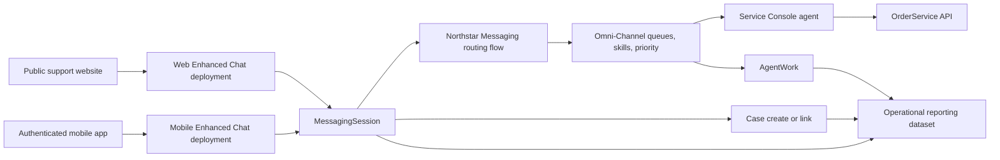
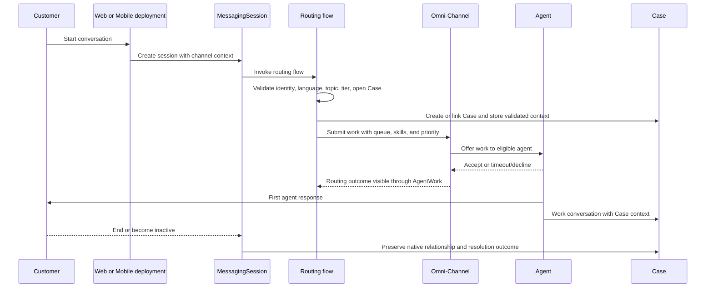
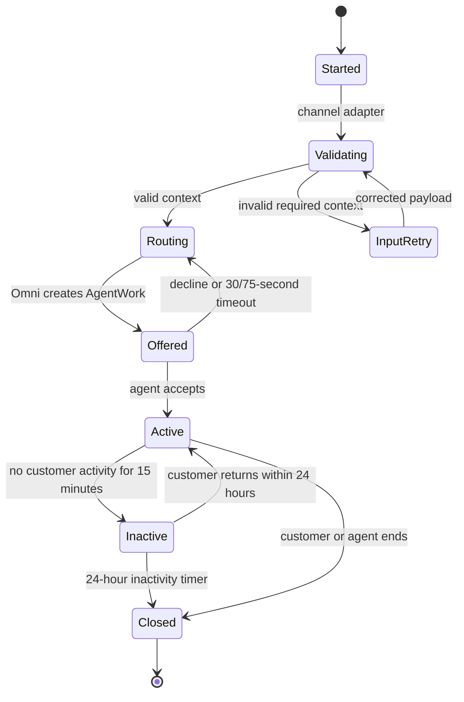
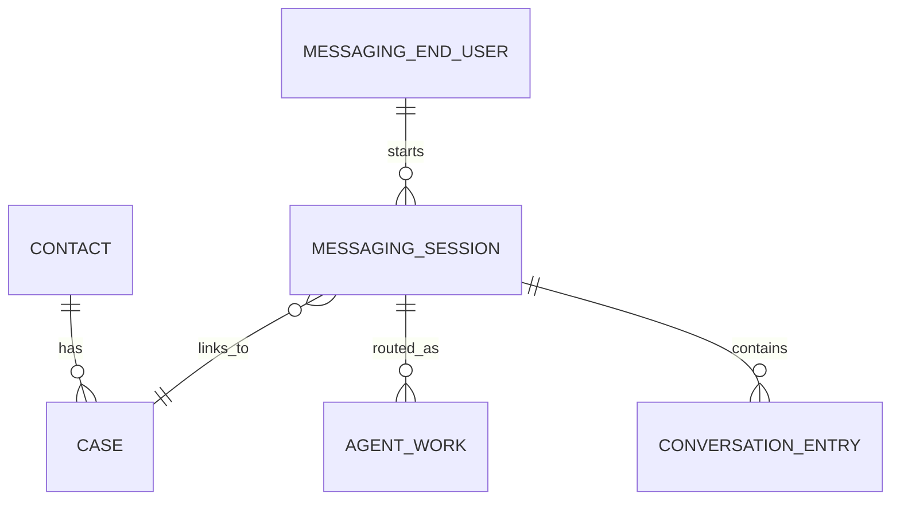

# Northstar Customer Support — Legacy Chat to Enhanced Chat Migration

## Solution Design Draft — v2

<!-- FICTIONAL DEMO DOCUMENT. Revised by the fictional author in response to UX-010 review round 01. -->

Author: J. Rivera, Associate Consultant  
Status: Revised draft for review  
Responds to: `UX-010-review-round-01.md`

## 1. Executive Summary

Northstar Outdoor Equipment will replace Salesforce Legacy Chat on its e-commerce website with Enhanced Chat (Messaging for In-App and Web) and add authenticated messaging to its mobile app. The design uses two channel-specific Enhanced Chat deployments—one web and one mobile—because the channels have different identity, release, branding, and rollback needs. Both deployments use the same governed Omni-Channel routing flow, Case-continuity pattern, supported-language skills, service queues, and reporting definitions.

The design favors native MessagingSession, AgentWork, Case, MessagingEndUser, and conversation-entry relationships. The previously proposed `Chat_Interaction__c` object has been removed because R-07 can be met without a second relationship store. The design keeps three matters for accountable architecture disposition: the final Pro Gear operating model, transcript attachment versus reference, and final proactive-invitation content.

## 2. Scope, Requirements, and Design Decisions

### 2.1 Requirements source

The authoritative requirement list remains `northstar-requirements.md`, R-01 through R-08. No requirement changed in this revision.

### 2.2 Assumptions and open decisions

The current register is `northstar-assumptions-open-decisions-v2.md`. It adds recommendations and decision consequences without treating them as approved.

### 2.3 Key design decisions in this revision

| Decision | Design position | Requirement / constraint | Tradeoff |
|---|---|---|---|
| Channel topology | Separate web and mobile deployments sharing one routing flow | R-01, R-02; mobile and web release independently | Two deployments add configuration governance but allow channel-specific identity, release, rollback, and branding |
| Case continuity | Prefer the case owner briefly when eligible, then route to a context-qualified pool | R-04 and R-05 | Preserves continuity when practical without allowing an owner to become an unbounded bottleneck |
| Interaction data | Use native MessagingSession-to-Case relationship; remove `Chat_Interaction__c` | R-07 | Avoids duplicate relationship truth; reporting must join standard records |
| Pro Gear | Recommend skills-based routing; keep OD-01 open for formal decision | R-03; current staff work across product areas | More flexible capacity, but depends on accurate skill maintenance |
| Transcript storage | Recommend Case reference to the native transcript; keep OD-02 open | R-07 | Avoids duplicated files, but Case users need permission to open the linked transcript |

## 3. Current State

Legacy Chat supports the website only. Three buttons—Orders, Returns, and Pro Gear—map to three agent skills. Fourteen agents across two shifts handle about 900 chats per week. Four agents are bilingual in English and Spanish. Weekly dashboards based on LiveChatTranscript report wait time, abandonment, and handle time.

The migration must preserve those three operational metrics, add a measurable two-minute first-response outcome, and prevent the two new channels from silently creating different definitions.

## 4. Target Architecture and Deployment Topology

### 4.1 Channel deployments

Northstar will configure two Enhanced Chat deployments:

| Deployment | Surface | Identity | Release owner | Channel-specific configuration |
|---|---|---|---|---|
| `Northstar_Web_Support` | Public support website | Anonymous initially; email supplied in pre-chat | Web team | Web branding, supported-page allowlist, proactive invitation, web rollback switch |
| `Northstar_Mobile_Support` | Logged-in iOS/Android app | Signed-in customer ID supplied by the mobile wrapper | Mobile app team | SDK version, authenticated context payload, mobile branding, app-release feature flag |

Both deployments invoke versioned routing flow `Northstar_Messaging_Route_v1`. Queue, skill, priority, timeout, and fallback rules are centralized in that flow and its controlled routing metadata. Channel-specific deployments do not contain divergent business routing logic.

### 4.2 System context

### 4.3 Configuration ownership

- Salesforce platform owner owns both deployment configurations, the routing flow, permission sets, and promotion between environments.
- Web team owns snippet placement, page allowlist, and web feature flag.
- Mobile team owns SDK integration, signed-in context payload, and mobile feature flag.
- Support operations owns queue membership, agent skills, business hours, capacity, and escalation coverage.
- Analytics owner owns KPI validation and the weekly dashboard.

## 5. End-to-End Conversation Flow

### 5.1 Session start and validation

1. Web pre-chat collects email, topic, preferred language, and optional order number. Mobile supplies authenticated customer ID, current screen, app version, preferred language, and optional order number.
2. The channel adapter rejects payloads that fail schema version, required-field, length, or allowed-value validation. The customer sees a retry message; invalid optional context is discarded and logged without exposing its value.
3. Mobile customer ID is matched to exactly one Contact through the approved external-ID field. Web email is treated as a lookup hint, not proof of identity.
4. Zero or multiple matches route to an unverified-customer branch. No Contact is automatically linked, and agents must verify the customer before exposing Case or order details.
5. The routing flow creates a new Case or links the MessagingSession to the qualifying open Case. “Qualifying” means open, support-owned, and associated with the uniquely verified Contact.

### 5.2 Case selection

- Exactly one qualifying open Case for the selected product/topic: link it.
- More than one qualifying Case: do not guess; create a new triage Case, flag `Case match required`, and let the agent select the relationship after verification.
- No qualifying Case: create a Case with source `Messaging`, channel, language, product/topic, customer tier, and verification state.
- The native MessagingSession-to-Case relationship is the only relationship source of truth.

## 6. Routing Design

### 6.1 Inputs and precedence

The routing flow evaluates inputs in this order:

1. **Business-hours state** determines live routing versus after-hours capture.
2. **Identity and Case context** determine whether verified context may be shown and whether a case owner is eligible for a short preference window.
3. **Language** determines mandatory language skill when Spanish is explicitly requested.
4. **Product/topic** determines Orders, Returns, Pro Gear, or General Support eligibility.
5. **Customer tier** determines Omni routing priority; it never removes language or product eligibility requirements.
6. **Availability and capacity** select an agent from the eligible target; bounded fallback rules apply when no one accepts.

Customer tier changes ordering among otherwise eligible work; it does not allow a Pro-tier conversation to bypass language, verification, or capacity constraints.

### 6.2 Input normalization

| Input | Accepted values | Missing / invalid behavior |
|---|---|---|
| Language | English, Spanish | Use English only as a conversation-language default; set `Language unconfirmed` so the agent asks before discussing case details |
| Product/topic | Orders, Returns, Pro Gear | Route to General Support with `Topic unconfirmed` |
| Tier | Pro, Standard | Default to Standard unless verified account data confirms Pro |
| Open Case | One qualifying Case | Zero creates a Case; multiple creates triage Case and flags manual match |
| Channel | Web, Mobile | Reject unknown channel/schema and show retry path |

Conflicting customer-entered and verified CRM values use the verified CRM value for tier and identity. The customer-entered topic remains routing context but does not overwrite Case or Contact data.

### 6.3 Target matrix

| Language | Product/topic | Required eligibility | Primary target | Fallback target |
|---|---|---|---|---|
| English | Orders | Orders skill | Orders pool | General Support with Orders escalation flag |
| English | Returns | Returns skill | Returns pool | General Support with Returns escalation flag |
| English | Pro Gear | Pro Gear skill under recommended OD-01 option | Cross-product skilled pool | General Support with Pro Gear escalation flag |
| Spanish | Orders | Spanish + Orders skills | Bilingual Orders pool | Spanish General Support pool |
| Spanish | Returns | Spanish + Returns skills | Bilingual Returns pool | Spanish General Support pool |
| Spanish | Pro Gear | Spanish + Pro Gear skills under recommended OD-01 option | Bilingual Pro Gear-skilled pool | Spanish General Support pool with Pro Gear escalation flag |
| Unconfirmed | Any | No language restriction until confirmed | Corresponding English/default pool with visible prompt | General Support |

No fallback removes the Spanish skill after Spanish is confirmed. If no Spanish-skilled agent can accept within the live-routing budget, the customer receives an honest delay message and the conversation remains in the Spanish overflow queue for the bilingual escalation owner; it is not silently sent to an English-only agent.

### 6.4 Priority mechanism

- Pro-tier work is assigned Omni routing priority `1`; Standard is priority `5`.
- Within the same priority, the earliest `Routing entered at` timestamp is offered first.
- Returning-case preference changes the first eligible target only; it does not change tier priority.
- Support operations may not manually promote Standard work above Pro work except during an incident declared by the support manager and logged in the incident record.

### 6.5 Returning customer and case-owner preference

R-04 requires an agent with case context, not necessarily the Case owner. The agent console surfaces the linked Case and conversation history to any authorized receiving agent.

When the verified customer has exactly one qualifying open Case:

1. If the Case owner is an active messaging agent, has the required language/product eligibility, is present, and has capacity, Omni offers the work to that owner for **30 seconds**.
2. If the owner is ineligible, unavailable, at capacity, out of office, declines, or does not accept within 30 seconds, the work immediately enters the matrix target above.
3. At **75 seconds from routing entry**, any still-unaccepted work expands to the defined fallback target without dropping mandatory language eligibility.
4. At **90 seconds**, the supervisor sees an R-05 warning in Omni Supervisor and the queue escalation channel. An available escalation agent may accept it.
5. The operating target is agent acceptance by 90 seconds, leaving 30 seconds for the agent’s first customer-visible response before the two-minute R-05 limit.

AgentWork timestamps and outcome identify each owner offer, decline, timeout, queue offer, and acceptance. The linked Case shows the routing target, current elapsed time, and escalation flag so the work does not disappear into an owner-only path.

### 6.6 No eligible target and after-hours behavior

- If no eligible agent has capacity during business hours, work remains visible in the language-appropriate overflow queue, the 90-second escalation fires, and the customer receives a delay notice with the option to continue asynchronously.
- After hours, the system does not promise the two-minute response. It records the message and Case, shows the next supported-hours window, and places work in the corresponding after-hours queue for oldest-first processing when service opens.
- A routing-flow fault routes to General Support only when language eligibility is known and preserved. Otherwise it routes to the language-triage queue. The fault creates an operations alert with session ID and flow version but no message body.

### 6.7 OD-01 candidate comparison

| Candidate | Flow | Strength | Cost / risk |
|---|---|---|---|
| Skills-based Pro Gear (recommended) | Product sets Pro Gear skill; language adds Spanish skill; Omni selects across skilled pools | Shares capacity across Orders/Returns/Pro Gear and supports combined-language eligibility | Skill accuracy and coverage require active governance |
| Dedicated Pro Gear queue | Product sends all Pro Gear work to a fixed queue; separate English/Spanish membership must be maintained | Simple queue ownership and reporting | Strands capacity, duplicates language membership, and makes after-hours/overflow rules more complex |

Both candidates use the same tier priority, 30/75/90-second timing, General Support/Spanish overflow behavior, and after-hours rules. OD-01 remains open for the senior architect.

## 7. Conversation Lifecycle

### 7.1 State model and enforcing mechanisms

- Salesforce Messaging session state is authoritative. The routing flow controls routing timers; Omni/AgentWork controls offers and acceptance; the messaging inactivity configuration controls inactive/closed transitions.
- Proactive invitations expire five minutes after display. The web deployment timestamps display and expiry; an expired invitation cannot start a session and is not counted as an abandoned conversation.
- At 12 minutes without customer activity, a warning is sent. At 15 minutes the session becomes inactive. A customer return within 24 hours resumes the same session when supported; after 24 hours, a new session is created and linked to the existing open Case when eligible.
- Failed state transitions are retried by the platform automation policy up to three times. A final failure creates an operations alert and leaves the Case open for manual follow-up.

### 7.2 Distinct end outcomes

Reporting distinguishes customer-ended, agent-ended, inactivity-closed, pre-acceptance abandoned, routing fault, and administrative closure. Closure reason is required before an agent ends a session; system closures supply the system reason.

## 8. Data Model and Record Ownership

### 8.1 Native relationship strategy

- MessagingSession links directly to its Case through the supported native relationship.
- MessagingEndUser represents the channel participant and links to a Contact only after deterministic match or agent verification.
- AgentWork represents each routing offer/assignment for the MessagingSession work item.
- Conversation entries remain the authoritative message/transcript events.
- `Chat_Interaction__c` is removed. No requirement needs a duplicate interaction object, and two relationship stores would create reconciliation risk.

### 8.2 Controlled reporting attributes

Where a standard field does not retain a required normalized value, a field on MessagingSession—not a second object—stores: routing-entry timestamp, first-agent-response timestamp, normalized channel, normalized language, normalized topic, customer tier at routing, final closure reason, and metric-quality flag. Automation stamps each once from its authoritative event and does not permit agents to edit timestamps.

The Salesforce platform owner owns the field definitions and automation. Analytics consumes them but does not write them.

## 9. Integration Design

### 9.1 Mobile context contract

Required payload: schema version, signed-in customer external ID, channel, app version, and correlation ID. Optional payload: current screen, language, topic, and order number.

- The mobile team versions the schema independently from the app; the Salesforce adapter supports current and immediately prior schema versions during the two-release transition window.
- Unknown schema or failed signature stops authenticated context use and gives the customer a retry path; it never falls back to trusting unsigned identity.
- Logs include correlation ID, schema version, outcome, and error category but exclude message text, email, customer ID, and order details.

### 9.2 OrderService use during conversation

- The agent explicitly initiates an order lookup after identity verification.
- Request timeout is five seconds. One automatic retry occurs only for a connection failure, using the same idempotent correlation ID.
- A second failure shows “Order details are temporarily unavailable”; the conversation continues and the agent may create a follow-up task. No partial response is written to the Case.
- OrderService API owner owns availability and backward compatibility; Salesforce platform owner owns the console component and credential rotation.
- Contract tests run against the current and next API version before either side releases.

## 10. Deployment, Migration, and Rollback

### 10.1 Release sequence

| Wave | Scope | Entry criteria | Exit criteria |
|---|---|---|---|
| Week 1 | Web deployment | Routing, identity, KPI, permissions, rollback, and load tests pass; agents trained | 48 business hours within thresholds; no stranded sessions; KPI completeness ≥99% |
| Week 3 | Mobile deployment | Web stable; supported SDK build approved; schema contract tests pass; app feature flag ready | 48 business hours within thresholds; authentication failures <1%; KPI completeness ≥99% |

Legacy Chat remains available for existing in-flight web sessions when the new web entry point is enabled. The old entry point is removed for new sessions, but Legacy Chat is disabled only after all in-flight sessions close or the support manager executes the documented manual transfer/contact plan.

### 10.2 Health signals

The command center monitors session-start success, routing-flow faults, unaccepted work at 90 seconds, first response within two minutes, identity-match exceptions, OrderService failures, abandonment, and records missing KPI timestamps. Metrics are split by deployment, language, product, and tier.

### 10.3 Rollback

- Web rollback disables the new snippet through the web feature flag and restores the Legacy Chat entry point while preserving already-started Enhanced Chat sessions.
- Mobile rollback disables new SDK session creation through the remote feature flag; existing sessions remain accessible. A corrected build follows normal app-release control.
- Routing configuration is promoted as a versioned flow. Rollback activates the previously validated version; active work is not deleted or re-parented.
- Rollback is triggered by the incident commander for sustained session-start failure above 2%, routing-flow faults above 1%, or any confirmed cross-customer data exposure. The incident record captures decision time, affected version, and customer follow-up.

## 11. Reporting and KPI Definitions

### 11.1 Authoritative sources

| Data | Object / event | Fields or derived attributes used |
|---|---|---|
| Session boundary | MessagingSession | session ID, start timestamp, end timestamp, status, channel, closure reason |
| Routing attempts | AgentWork related to the MessagingSession work item | request timestamp, accept timestamp, close timestamp, status, assigned user, sequence |
| Customer/agent messages | Standard conversation entry related to MessagingSession | entry timestamp and actor type; message body is excluded from KPI dataset |
| Case context | Case linked to MessagingSession | Case ID, product/topic, origin; no sensitive description text in analytics |
| Normalized dimensions | Controlled MessagingSession reporting fields | language, tier at routing, routing-entry time, first-agent-response time, metric-quality flag |

The implementation data-mapping test must confirm the exact API field names in the target org before dashboard build. The lifecycle definitions below are fixed even if a standard field’s physical API name differs by org release.

### 11.2 Metric definitions

| Metric | Start | End | Reroute / exception treatment | Legacy comparison |
|---|---|---|---|---|
| Average wait time | Earliest AgentWork request/routing-entry timestamp for the session | First accepted AgentWork timestamp | Includes owner preference, declines, timeouts, and queue reroutes; sessions never accepted are excluded from the average and counted separately as abandoned/unserved | Run both old and new definitions for two weeks; compare same business-hours population to LiveChatTranscript wait metric |
| Abandonment rate | Session enters live routing | Customer ends before any AgentWork is accepted | One session counted once regardless of AgentWork attempts; proactive invitation expiry is excluded; routing faults reported separately | Compare same business-hours population and document any Legacy Chat event-boundary difference |
| Agent handle time | Accepted AgentWork timestamp | That AgentWork close timestamp | Sum accepted AgentWork intervals for the session; exclude time waiting between agents; report transfer count separately | Compare aggregate weekly totals and per-session median with Legacy agent handle-time definition |
| First response time (R-05) | Routing-entry timestamp | First customer-visible conversation entry whose actor type is agent | Includes all owner/queue wait and reroutes; automated acknowledgements do not qualify; after-hours sessions excluded from SLA denominator and reported separately | New SLA measure; no claim of direct Legacy equivalence |
| R-05 compliance | Same as first response | First qualifying agent response ≤120 seconds | Never-routed, abandoned before acceptance, metric-missing, and after-hours sessions are separate denominator categories; dashboard exposes each | Establish migration baseline during web wave |

### 11.3 Data quality and reconciliation

- A session with missing required timestamps receives `metric-quality = incomplete` and appears in a daily exception report; it is never silently included as zero.
- Weekly reports show counts for accepted, abandoned, unserved, after-hours, routing-fault, and incomplete-metric sessions so denominator choices are visible.
- During the two-week parallel validation window, operations signs off on the legacy-to-new crosswalk and explains material variance greater than 5%.
- R-06 acceptance requires all three legacy KPI definitions to be approved by Support Operations and at least 99% of eligible sessions to have complete metric inputs.

## 12. Security, Privacy, and Retention

- Public web email is not authentication. Agents verify the customer before showing Case, order, or transcript details.
- Mobile identity requires a validated signed-in external ID and accepted schema/signature.
- Zero or multiple Contact matches do not auto-link. The agent sees a verification task, not candidate customer details.
- Permission sets grant transcript access only to support agents, supervisors, approved quality reviewers, and platform administrators according to role. Case access alone does not automatically expose unrelated transcripts.
- The recommended OD-02 option references the native transcript from the Case instead of copying it to a file. If formal review selects file attachment, the decision must also define duplicate-retention, encryption, deletion, and permission behavior.
- Standard transcript retention is 24 months, subject to Northstar legal/privacy confirmation before production. Legal hold overrides deletion. Sensitive payment data is prohibited in chat; invitation and agent guidance direct customers to the approved payment channel.
- Operational logs exclude transcript body and direct identifiers. Security audit events retain session/correlation IDs and access outcomes.

## 13. Proactive Invitation Design

The web deployment alone enforces proactive invitations on the allowlisted high-intent support pages: order status, returns help, and Pro Gear support. Baseline eligibility is 30 seconds on page with no active session and no dismissal in the prior seven days. One invitation is shown per browser session and expires after five minutes.

OD-03 remains open only for final wording and formal confirmation of the trigger threshold. Tests prove page allowlist, eligibility timing, suppression, five-minute expiry, accessibility labeling, mobile-web behavior, and that expiry is excluded from abandonment reporting.

## 14. Verification and Acceptance

| Requirement | Primary verification | Measurable acceptance |
|---|---|---|
| R-01 | Web cutover and rollback rehearsal | New web sessions start on Enhanced Chat; rollback restores entry point without losing active sessions |
| R-02 | Authenticated mobile end-to-end test | Supported app versions start sessions with validated identity context; invalid signature never links Contact |
| R-03 | Routing matrix tests | Every language/product/tier combination reaches the expected eligible target; missing/conflicting/no-capacity cases follow documented branches |
| R-04 | Open-Case scenarios | Unique verified Case links and surfaces context; multiple/zero matches do not expose wrong-customer data; owner timeout falls back within 30 seconds |
| R-05 | Timed load/UAT scenarios | At least 95% of eligible business-hours test sessions receive first agent response within 120 seconds; all failures have observable category |
| R-06 | Parallel dashboard reconciliation | KPI completeness ≥99%; material variance >5% explained and approved by Support Operations |
| R-07 | Case create/link and relationship tests | Each session has exactly one intended Case relationship; no `Chat_Interaction__c` dependency |
| R-08 | Invitation rule tests | Only allowlisted eligible pages show one accessible invitation; suppression and expiry behave as designed |

Additional negative tests cover owner unavailable/decline/capacity, no bilingual agent, after-hours, routing-flow fault, identity zero/multiple match, payload schema mismatch, OrderService timeout, inactivity/resume/closure, deployment rollback, missing KPI events, and permission-denied transcript access.

UAT uses trained agents plus Support Operations and Security representatives. Evidence includes test ID, requirement ID, environment, input conditions, expected/actual result, timestamp, and accountable sign-off. Production entry requires zero open Blocking defects and documented disposition of all open decisions.

## 15. Open Decisions for Formal Review

| ID | Recommended position | Alternative | Decision consequence |
|---|---|---|---|
| OD-01 | Skills-based Pro Gear routing | Dedicated Pro Gear queue | Determines staffing governance and configuration, but both paths use documented priority/fallback timing |
| OD-02 | Reference native transcript from Case | Attach transcript file | Determines duplicate storage, access, retention, and deletion controls |
| OD-03 | Use baseline invitation scope/trigger in Section 13; approve final wording | Adjust allowlist, time threshold, or wording | Determines customer experience and final R-08 acceptance cases |
| OD-E01 | Accept bounded 30-second owner preference with context-qualified fallback | Remove owner preference entirely | Balances continuity with R-05 risk; neither option permits unbounded owner routing |

No open decision changes the selected two-deployment topology, native Case relationship, mandatory Spanish eligibility, bounded fallback, or KPI lifecycle definitions.
